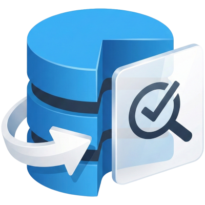

<div align="center">
  <a href="https://beyond-the-cloud-dev.github.io/test-lib/">
    <picture>
      <source media="(prefers-color-scheme: dark)" srcset="./website/public/logo.png">
      
    </picture>
  </a>
  <h1>Test Lib</h1>

<a href="https://beyondthecloud.dev"></a>
<a></a>
<a href="https://github.com/beyond-the-cloud-dev/test-lib/blob/main/LICENSE"></a>

[](https://github.com/beyond-the-cloud-dev/test-lib/actions/workflows/ci.yml)

</div>

# Test Lib (BETA)

Apex test data builder library with **Builder** and **Mocker** patterns for creating test records in Salesforce.

For comprehensive documentation, visit [https://beyond-the-cloud-dev.github.io/test-lib/](https://beyond-the-cloud-dev.github.io/test-lib/)

## Features

- **Builder Pattern** - Fluent API for creating real database records
- **Mocker Pattern** - Create in-memory records without DML operations
- **Templates** - Reusable record configurations for common scenarios
- **Randomizers** - Generate unique field values for bulk data creation
- **Parent Relations** - Mock parent lookups (e.g., `Account.Parent.Name`)
- **Child Relations** - Mock child collections (e.g., `Account.Contacts`)
- **Fake IDs** - Generate valid-looking IDs via `TestModule.IdGenerator`

## Quick Start

### Builder - Create Real Records

```apex
@IsTest
static void testWithRealRecords() {
    // Create single record
    Account acc = (Account) AccountTestModule.Builder()
        .withName('Acme Corp')
        .enterprise()
        .buildAndInsert();

    // Create multiple records with unique values
    List<Account> accounts = AccountTestModule.Builder()
        .withAccountRandomizer()
        .buildAndInsert(100);

    Assert.isNotNull(acc.Id);
    Assert.areEqual(100, accounts.size());
}
```

### Mocker - Create In-Memory Records

```apex
@IsTest
static void testWithMockedRecords() {
    // Create mock with fake ID
    Account acc = (Account) AccountTestModule.Mocker()
        .setFakeId()
        .build();

    // Mock with parent relationship
    Account accWithParent = (Account) AccountTestModule.Mocker()
        .withParentName('Parent Corp')
        .build();

    // Mock with child records
    List<Contact> contacts = (List<Contact>) ContactTestModule.Mocker().build(3);
    Account accWithContacts = (Account) AccountTestModule.Mocker()
        .withContacts(contacts)
        .build();

    Assert.areEqual('Parent Corp', accWithParent.Parent.Name);
    Assert.areEqual(3, accWithContacts.Contacts.size());
}
```

## Installation

### Using Salesforce CLI

```bash
# Clone the repository
git clone https://github.com/beyond-the-cloud-dev/test-lib.git
cd test-lib

# Deploy to your org
sf project deploy start --target-org your-org-alias
```

### Deploy to Salesforce

<a href="https://githubsfdeploy.herokuapp.com?owner=beyond-the-cloud-dev&repo=test-lib&ref=main">
  
</a>

## Documentation

Full documentation: [https://beyond-the-cloud-dev.github.io/test-lib/](https://beyond-the-cloud-dev.github.io/test-lib/)

### Documentation Sections

- **[Getting Started](https://beyond-the-cloud-dev.github.io/test-lib/getting-started)** - Introduction and setup
- **[Builder Pattern](https://beyond-the-cloud-dev.github.io/test-lib/builder)** - Creating real database records
- **[Mocker Pattern](https://beyond-the-cloud-dev.github.io/test-lib/mocker)** - Creating in-memory mocks
- **[Templates](https://beyond-the-cloud-dev.github.io/test-lib/templates)** - Reusable record configurations
- **[Randomizers](https://beyond-the-cloud-dev.github.io/test-lib/randomizers)** - Generating unique values
- **[API Reference](https://beyond-the-cloud-dev.github.io/test-lib/api)** - Complete API documentation
- **[Examples](https://beyond-the-cloud-dev.github.io/test-lib/examples)** - Practical code examples

### Run Documentation Locally

```bash
npm install
npm run docs:dev
```

## Project Structure

```
force-app/main/default/classes/
├── TestModule.cls                    # Core framework
├── TestModule.cls-meta.xml
├── TestModule_Test.cls               # Framework tests
├── TestModule_Test.cls-meta.xml
└── concrete-modules/                 # Example implementations
    ├── AccountTestModule.cls
    ├── ContactTestModule.cls
    └── OpportunityTestModule.cls
```

## Creating a Test Module

```apex
@IsTest
public class AccountTestModule {

    public static AccountBuilder Builder() {
        return new AccountBuilder();
    }

    public static AccountMocker Mocker() {
        return new AccountMocker();
    }

    public class AccountBuilder extends TestModule.RecordBuilder {
        public AccountBuilder() {
            super(new Templates());
        }

        public AccountBuilder withName(String name) {
            super.set(Account.Name, name);
            return this;
        }

        public AccountBuilder enterprise() {
            super.useTemplate('enterprise');
            return this;
        }
    }

    public class AccountMocker extends TestModule.RecordMocker {
        public AccountMocker() {
            super(new Account(Name = 'Test Account', Industry = 'Technology'));
        }

        public AccountMocker withContacts(List<Contact> contacts) {
            super.setChildren('Contacts', contacts);
            return this;
        }

        public AccountMocker withParentName(String parentName) {
            super.set('Parent.Name', parentName);
            return this;
        }
    }

    public class Templates implements TestModule.Template {
        public SObject defaultTemplate() {
            return new Account(Name = 'Test Account', Industry = 'Technology');
        }

        public Map<String, SObject> templates() {
            return new Map<String, SObject>{
                'enterprise' => new Account(Name = 'Enterprise Account', AnnualRevenue = 1000000),
                'startup' => new Account(Name = 'Startup Account', AnnualRevenue = 100000)
            };
        }
    }
}
```

## Core Interfaces

```apex
// Builder - creates real records for database insertion
public interface Builder {
    Builder set(SObjectField field, Object value);
    Builder set(String field, Object value);
    Builder useTemplate(String templateName);
    Builder withRandomizer(TestModule.RecordRandomizer randomizer);
    Builder withRandomizer(SObjectField field, TestModule.FieldRandomizer randomizer);
    SObject build();
    SObject buildAndInsert();
    List<SObject> build(Integer amount);
    List<SObject> buildAndInsert(Integer amount);
}

// Mocker - creates in-memory records without DML
public interface Mocker {
    Mocker set(SObjectField field, Object value);
    Mocker set(String field, Object value);  // Supports dot notation for parent relationships
    Mocker setChildren(String relationship, List<SObject> children);
    Mocker setFakeId();
    Mocker withRandomizer(TestModule.RecordRandomizer randomizer);
    Mocker withRandomizer(SObjectField field, TestModule.FieldRandomizer randomizer);
    SObject build();
    List<SObject> build(Integer amount);
}

// FieldRandomizer - generates values for a single field
public interface FieldRandomizer {
    Object generate(Integer index);
}

// RecordRandomizer - generates values for multiple fields
public interface RecordRandomizer {
    Map<SObjectField, TestModule.FieldRandomizer> randomizers();
}
```

## Contributors

<a href="https://github.com/beyond-the-cloud-dev/test-lib/graphs/contributors">
  
</a>

## License

MIT License

Copyright © 2025 Beyond The Cloud Sp. z o.o. (BeyondTheCloud.Dev)

See [LICENSE](LICENSE) file for details.

## About Beyond The Cloud

This library is maintained by [Beyond The Cloud](https://beyondthecloud.dev) - experts in Salesforce development.

**Connect with us:**

- Website: [beyondthecloud.dev](https://beyondthecloud.dev)
- LinkedIn: [Beyond The Cloud](https://www.linkedin.com/company/beyondtheclouddev)
- GitHub: [@beyond-the-cloud-dev](https://github.com/beyond-the-cloud-dev)

## Support

- **Documentation**: [Full documentation](https://beyond-the-cloud-dev.github.io/test-lib/)
- **Issues**: [GitHub Issues](https://github.com/beyond-the-cloud-dev/test-lib/issues)
- **Discussions**: [GitHub Discussions](https://github.com/beyond-the-cloud-dev/test-lib/discussions)
